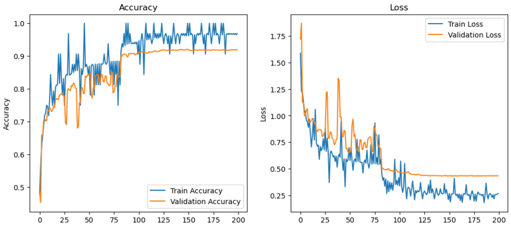
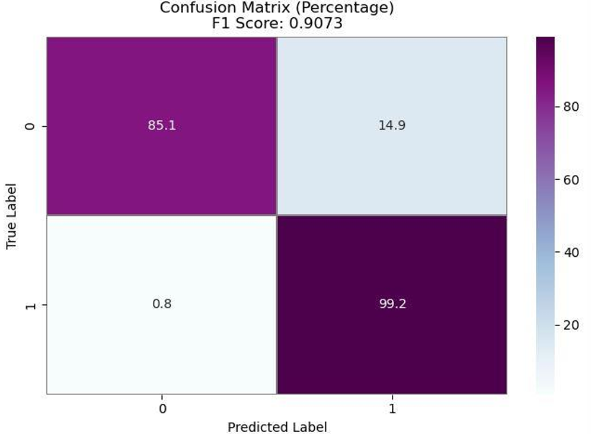
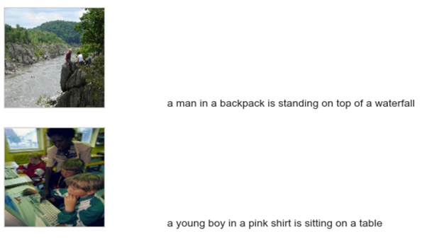
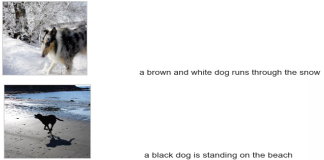
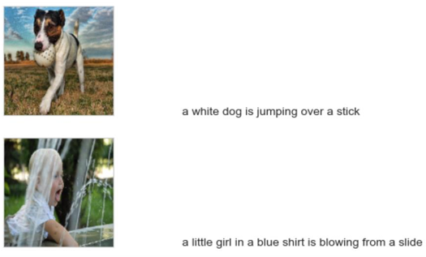

# 🧠 Computational Intelligence — Deep Learning Image Processing Project

This repository presents a comprehensive **deep learning project** developed for the course **“Introduction to Computational Intelligence”** at **Amirkabir University of Technology (Tehran Polytechnic)**.  
The project includes **three major phases**, each addressing a distinct computer vision problem using **CNNs**, **ResNet architectures**, and **sequence models (LSTM)**.

> **Team Members:**  
> Amirhossein Asadi — Amirhossein Bagheri — Arvin Jebreili — Maryam Hosseini  
> **Semester:** Fall 2024  

---

## 📘 Project Overview

The project covers three progressive deep learning tasks:

1. **CIFAR-10 Image Classification** (ResNet-20 implemented from scratch)  
2. **Breast Cancer Image Classification** (custom CNN)  
3. **Image Captioning** (CNN encoder + LSTM decoder using Flickr-8k)

Each phase demonstrates the design, training, and evaluation of neural models on real-world datasets.

---

## ⚙️ Phase 1 — CIFAR-10 Image Classification

### 🎯 Objective
Build and train a **ResNet-20** architecture from scratch for the **CIFAR-10** dataset (10 categories).

### 🧠 Highlights
- Implemented **Residual Blocks**, **Batch Normalization**, and **ReLU** manually.  
- Used **data augmentation** and **learning rate scheduling** for better generalization.  
- Optimizer: **Adam**, initial LR = 0.001 (with decay schedule).

### 📊 Results

| Metric | Value |
|:-------|:------|
| **Validation Accuracy** | 92% |
| **Test Accuracy** | 90.7% |
| **Test Loss** | 0.4713 |

#### 📈 Training Progress

---

## ⚕️ Phase 2 — Breast Cancer Image Classification

### 🎯 Objective
Classify histopathological breast tissue images into **IDC(+)** (cancerous) and **IDC(-)** (non-cancerous) using a CNN built from scratch.

### 🧠 Highlights
- Dataset of **193,811** microscopic image tiles.  
- CNN with convolutional, pooling, and dense layers.  
- Applied **Batch Normalization** and **Dropout** to prevent overfitting.

### 📊 Results

| Metric | Value |
|:-------|:------|
| **Accuracy** | 90.7% |
| **F1 Score (IDC+)** | 0.9073 |

#### 📈 Confusion Matrix

#### 📉 Loss and Accuracy

---

## 🖼️ Phase 3 — Image Captioning (Flickr8k)

### 🎯 Objective
Generate meaningful captions for images by combining **visual understanding (CNN)** and **language modeling (LSTM)**.

### 🧠 Approach
- Feature extraction via **InceptionV3 (ImageNet pretrained)**.  
- Text sequence modeling with **LSTM**.  
- Word embedding dimension = 300.  
- Dataset: **Flickr8k** (8,000 images, 5 captions each).  

### ⚙️ Training Summary

| Parameter | Value |
|:-----------|:-------|
| **Batch Size (train/val)** | 270 |
| **Training Loss** | 2.3952 |
| **Validation Loss** | 3.6134 |

#### 🧩 Example Captions

---

## 🧠 Technologies Used

- **Python 3.x**  
- **TensorFlow / Keras**  
- **PyTorch (for captioning)**  
- **NumPy, Pandas**  
- **Matplotlib, Seaborn**  
- **Google Colab / Kaggle Datasets**

---

## 📂 Repository Structure

